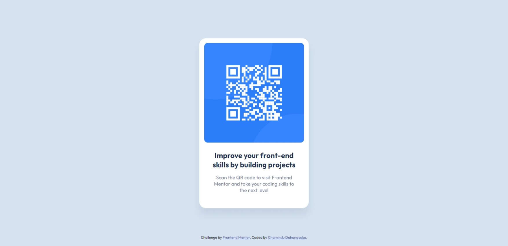

# Frontend Mentor - QR code component solution

This is a solution to the [QR code component challenge on Frontend Mentor](https://www.frontendmentor.io/challenges/qr-code-component-iux_sIO_H). Frontend Mentor challenges help you improve your coding skills by building realistic projects. 

## Table of contents

- [Overview](#overview)
  - [Screenshot](#screenshot)
  - [Links](#links)
- [My process](#my-process)
  - [Built with](#built-with)
  - [What I learned](#what-i-learned)
  - [Continued development](#continued-development)
- [Author](#author)

## Overview

### Screenshot



### Links

- Solution URL: [Solution URL here](https://www.frontendmentor.io/solutions/qr-code-component-tsVtozlg2F)
- Live Site URL: [Live site URL here](https://chamindud.github.io/QR-code-component/)

## My process

### Built with

- HTML
- CSS

### What I learned

In this project, I learned to use below code snippet:

```html
<link rel="icon" type="image/png" sizes="32x32" href="./images/favicon-32x32.png">
```

### Continued development

I'm looking to improve my CSS knowledge to design more unique and new stuff.

## Author

- Frontend Mentor - [@ChaminduD](https://www.frontendmentor.io/profile/ChaminduD)
- LinkedIn - [Chamindu Dahanayaka](https://www.linkedin.com/in/chamindudahanayaka/)